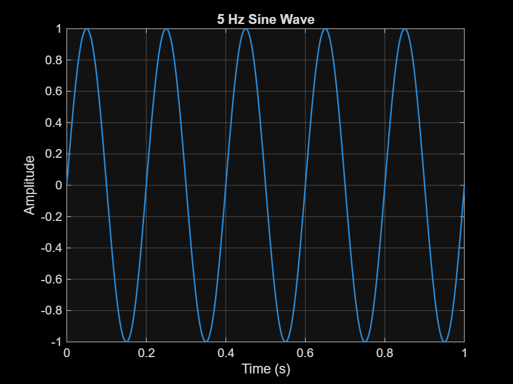
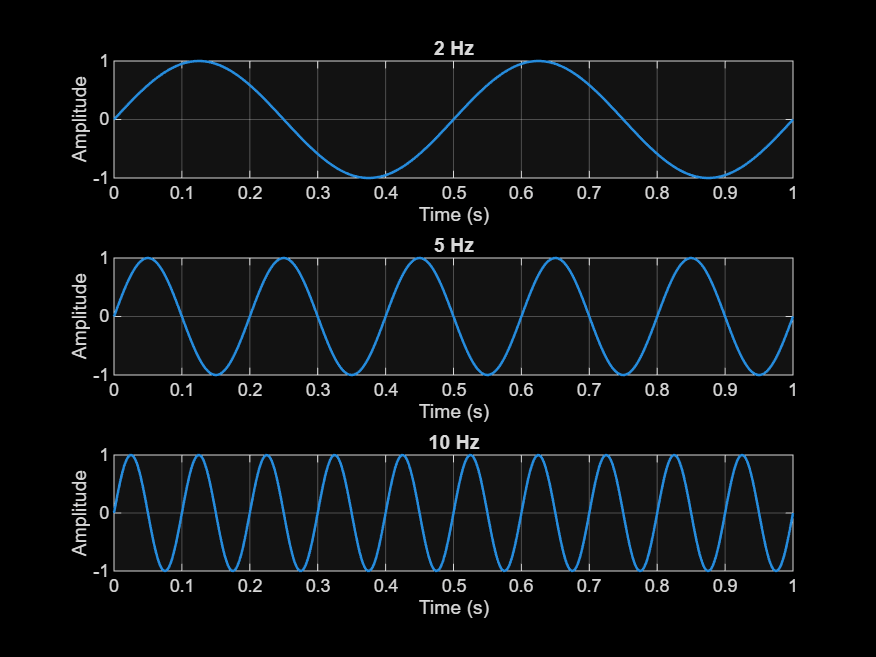
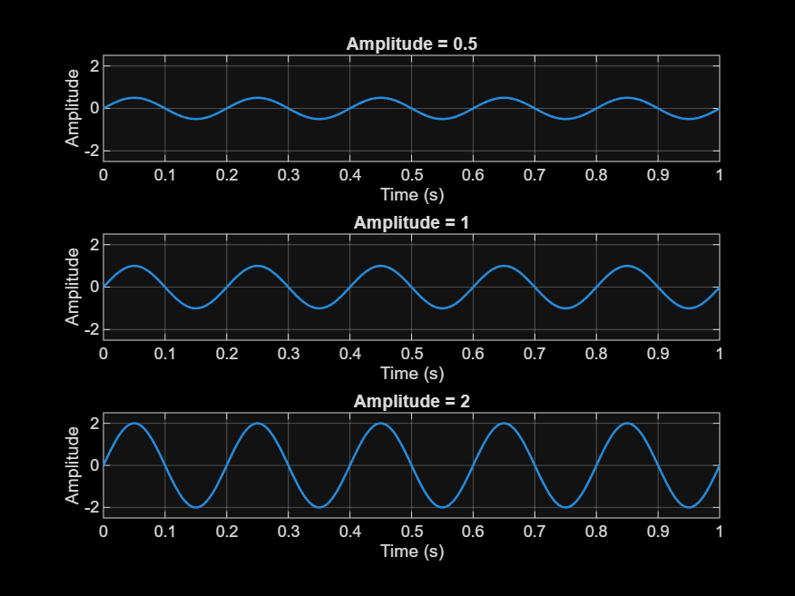
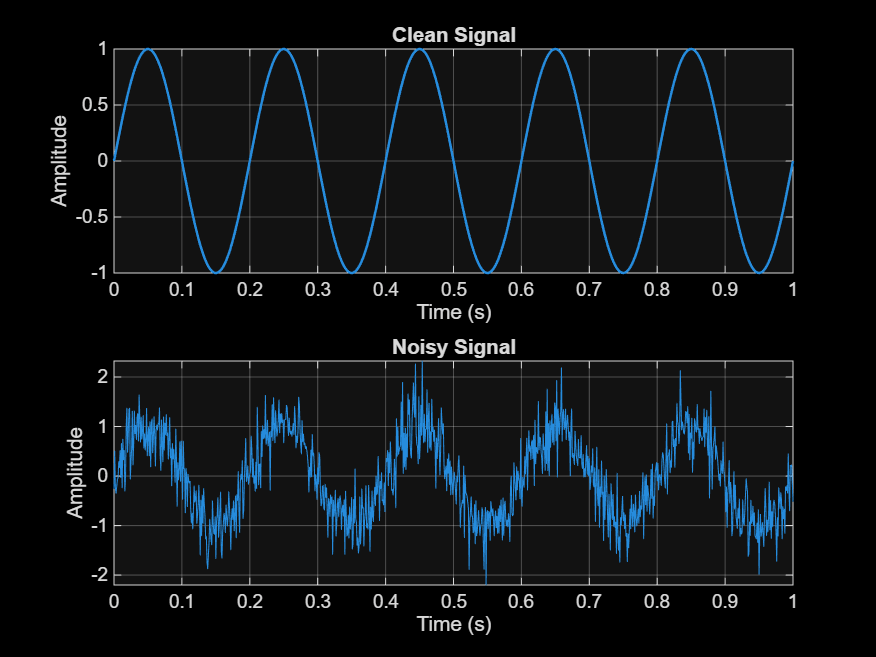

# Lecture 01 - Signal Visualization

Files in this folder:
- `Lecture01_signal_visualization.m` - MATLAB script that generates all signals and saves the figures
- `frequency_comparison.png`, `amplitude_comparison.png`, `clean_vs_noisy_signal.png` - saved figures
- `sine_wave_5Hz.png` - extra figure for Task 1

## Task 1: Create a Sine Wave
A sine wave with amplitude 1, frequency 5 Hz and duration 1 second, with a title, axis labels and grid.

## Task 2: Compare Different Frequencies

- **Which signal changes fastest?** The 10 Hz signal. It completes 10 full cycles in one second.
- **Which signal has the lowest frequency?** The 2 Hz signal.
- **How can you see the difference in the plots?** By counting the cycles. The 10 Hz plot has many more peaks in the same 1 second than the 2 Hz plot.

## Task 3: Compare Different Amplitudes

- **Which signal has the largest amplitude?** The signal with amplitude 2. Its peaks reach +2 and -2.
- **Does changing amplitude change frequency?** No. All signals have the same 5 Hz frequency. Only the height of the wave changes.
- **Real-world example:** Audio volume. A larger amplitude in a sound wave means a louder sound.

## Task 4: Add Noise

- **What changed after adding noise?** The smooth sine wave became jagged and irregular because random values were added to every sample.
- **Can you still recognize the original signal?** Yes. The 5 Hz oscillation is still visible because the noise is small compared to the amplitude of 1.
- **Real-world source of noise:** Electrical interference in a sensor or microphone circuit.

## Task 5: Save Figures
The script saves `frequency_comparison.png`, `amplitude_comparison.png` and `clean_vs_noisy_signal.png` using `saveas`.

## Task 6: Use AI Responsibly

**AI Tool Used:** Claude

**Prompt:**
I pasted the full assignment text (Tasks 1 to 6) and asked Claude to guide me step by step in MATLAB Online. Later I pasted my own script style (using `Fs`, `t`, and `saveas`) and asked for code like it that shows all the figures and saves all the images.

**What AI Suggested:**
Claude suggested a MATLAB script that generates the 5 Hz sine wave, three frequency signals (2, 5, 10 Hz) and three amplitude signals (0.5, 1, 2) displayed with subplots, and a clean vs noisy signal using `randn`. It also suggested saving each figure with `saveas`, and gave steps for the README and the GitHub upload.

**Did the code work immediately?**
[EDIT THIS LINE: write Yes or No. If there was an error, write what it was and how you fixed it.]

**What did you modify?**
- Kept my own script style (variable names `Fs`, `t`, `x2`, `x5`, `x10`)
- Changed the overlaid plots into subplots, as the assignment requires
- Added `ylim([-2.5 2.5])` on the amplitude plots so the size differences are visible
- Added `rng(1)` so the noise is the same every run
- Added `drawnow` so every figure appears before it is saved
- Renamed the script to `Lecture01_signal_visualization.m` and added the images to this README

**How did you verify the result?**
- Counted the cycles in each plot: 2, 5 and 10 cycles in 1 second
- Checked that the amplitude plots peak at 0.5, 1 and 2, and that the frequency stays the same
- Checked that the noisy signal still shows the 5 Hz oscillation
- Confirmed the three PNG files were created and open correctly
